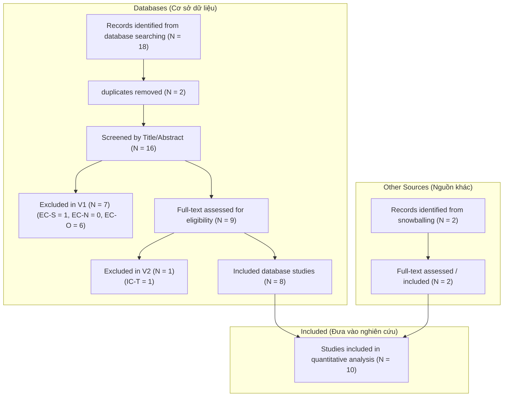

PRISMA Flow Diagram (Sơ đồ luồng PRISMA)
Thành viên: Nguyen Tuan Vinh
Chủ đề: LLM for Unit Test Case Generation

---

Kiểm tra tính nhất quán (Consistency Check)
- Tổng số bản ghi tìm thấy (Total Identified: 20) gồm 18 từ cơ sở dữ liệu và 2 từ snowballing.
- Loại bỏ trùng lặp (duplicates removed): 2 trùng lặp giữa các chuỗi tìm kiếm trong cơ sở dữ liệu.
- Số lượng bản ghi đưa vào lọc vòng 1 (Screened by Title/Abstract): 16 bản ghi độc nhất từ cơ sở dữ liệu (18 - 2 = 16) + 2 bản ghi từ snowballing.
- Số lượng bản ghi loại vòng 1 (Excluded in V1): 7 bản ghi từ cơ sở dữ liệu.
- Số lượng bản ghi thẩm định vòng 2 (assessed for eligibility): 9 bản ghi cơ sở dữ liệu (16 - 7 = 9) và 2 bản ghi snowballing.
- Số lượng bản ghi loại vòng 2 (Excluded in V2): 1 bản ghi cơ sở dữ liệu (loại IC-T).
- Số lượng nghiên cứu cuối cùng đưa vào phân tích (quantitative analysis): 10 bản ghi (gồm 8 bản ghi cơ sở dữ liệu và 2 bản ghi snowballing).

Liên kết tệp tin CSV:
- Tệp 01_all_records.csv chứa 18 dòng tương ứng với 16 bài cơ sở dữ liệu độc nhất + 2 bài snowballing.
- Tệp 02_after_screening_v1.csv chứa 18 dòng hiển thị đầy đủ quyết định vòng 1 (11 dòng INCLUDE và 7 dòng EXCLUDE).
- Tệp 03_final_included.csv chứa 18 dòng hiển thị quyết định đầy đủ cả hai vòng (10 dòng Include cuối cùng, 1 dòng loại ở vòng 2, và 7 dòng loại ở vòng 1).
- Tính giảm dần của các bài được đưa vào: 16 (cơ sở dữ liệu) + 2 (snowballing) -> 11 bài qua vòng 1 -> 10 bài qua vòng 2 cuối cùng.
